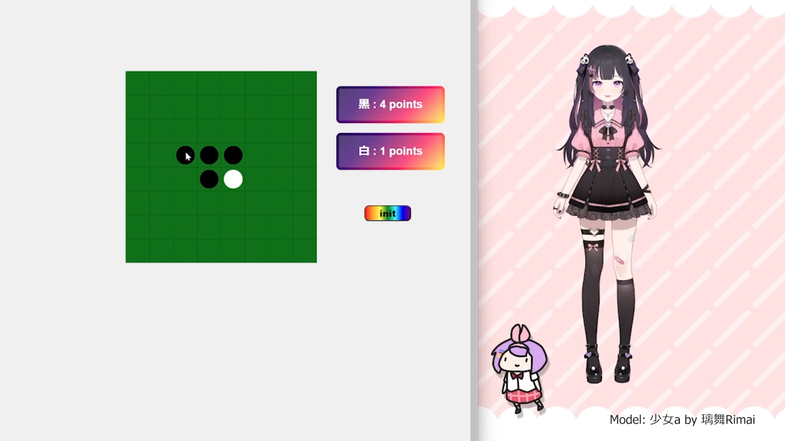

# Othello Game

A virtual ai character that can play Othello with you while narrating the game.

ゲームのナレーションをしながら、一緒にオセロをして遊べるバーチャル AI キャラクター。

Demo:

<video src="Demo2.mp4" width="320" height="240" controls unmuted></video>

# Frontend

## react + styled components

# Response Generation: ChatGPT

# Character

## Live2D Model

Model: 少女 a by 璃舞 Rimai

Motions are from free materials: haru_greeter_pro_jp by Live2D

VTube Studio:

- Audio Plugin: VTS Desktop Audio
  - Mouth Open <-> VTS Desktop Volume
- python api: pyvts

https://github.com/DenchiSoft/VTubeStudio
https://github.com/Genteki/pyvts

# Sound

VITS
